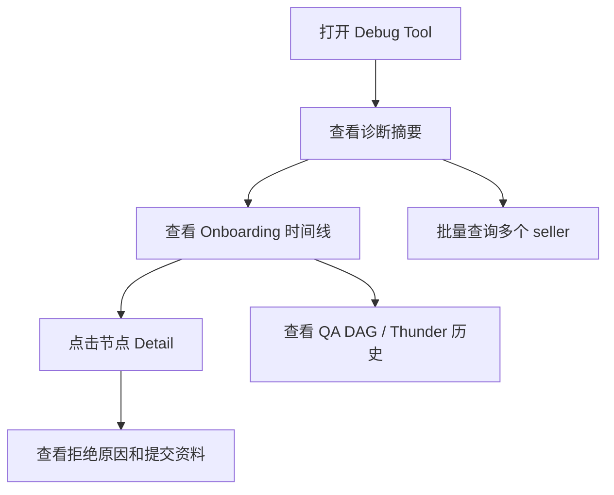

# GNE Seller Onboarding Debug Tool 前端原型 PRD

## 1. 产品概述

基于 `gne_seller_onboarding_debug_tool_requirements.md`，构建一个可交互的前端原型，用于演示优化后的 GNE seller onboarding debug tool。目标用户是 GNE 运营、QA、治理支持和排查同学，核心价值是更快判断 seller 卡点、拒绝原因、证据资料和跨工具审核链路。

## 2. 核心功能

### 2.1 用户角色

| 角色 | 使用方式 | 核心权限 |
|------|----------|----------|
| GNE 运营 | 打开内部工具页面 | 查看 seller 摘要、时间线、Detail、证据、批量查询 |
| QA / 工程排查 | 打开内部工具页面 | 查看审核 DAG、系统字段、任务 ID、原始链路信息 |

### 2.2 功能模块

1. **搜索与 Seller 基础信息**：展示 seller ID、店铺名、状态、seller type、company、violation score、probation status。
2. **一页式诊断摘要**：展示当前状态、当前卡点、最新失败节点、失败原因、责任方、下一步。
3. **可解释 Onboarding 时间线**：展示 Pre Check、Pre KYC/KYB、KYB/KYC Vendor、TCS Review 等节点的状态和顺序。
4. **统一 Detail 抽屉**：点击节点查看结论、时间、审核方、拒绝原因、提交资料、系统信息。
5. **图片和资料内置查看**：在 Detail 中展示证件、地址证明、营业执照等 evidence 卡片。
6. **QA Tool 和 Thunder 信息整合**：展示审核 DAG 和完整历史记录的业务化视图。
7. **批量查询和导出**：输入多个 seller ID，展示批量状态、卡点、拒绝原因和建议动作。

### 2.3 页面详情

| 页面名称 | 模块名称 | 功能描述 |
|----------|----------|----------|
| Debug Tool 首页 | Pearl 风格框架 | 顶部黑色导航、左侧菜单、主内容区，参考原 Pearl 平台视觉 |
| Debug Tool 首页 | 诊断摘要 | 用高亮卡片展示 seller 当前卡点和下一步 |
| Debug Tool 首页 | 时间线 | 用状态节点展示 onboarding 全链路 |
| Debug Tool 首页 | Detail 抽屉 | 节点详情从右侧抽屉打开，支持 evidence 和系统信息 |
| Debug Tool 首页 | QA / Thunder 面板 | 以双栏卡片展示 DAG 与历史节点 |
| Debug Tool 首页 | 批量查询 | 支持输入 mock seller ID 并展示结果表 |

## 3. 核心流程

用户进入页面后，默认展示一个 rejected seller 的完整排查视图；用户可点击时间线节点打开 Detail 抽屉；用户可切换业务视图、查看 QA DAG、查看提交资料，也可在批量查询区域模拟批量排查。

## 4. 用户界面设计

### 4.1 设计风格

- 视觉参考：Pearl 原平台，使用企业后台风格、顶部黑色导航、左侧浅灰菜单、白色卡片和细边框。
- 主色：Pearl teal / green，用于当前选中、通过状态和主按钮。
- 辅色：红色用于 reject，蓝色用于链接和信息标签，灰色用于 skipped / pending。
- 字体：使用稳定的无衬线字体栈，保证后台系统可读性。
- 布局：桌面优先，主内容采用卡片 + 网格 + 右侧抽屉。
- 动效：轻量 hover、抽屉滑入、卡片聚焦，不做过度动画。

### 4.2 页面设计概览

| 页面名称 | 模块名称 | UI 元素 |
|----------|----------|---------|
| 首页 | 顶部导航 | Pearl 标识、站点选择、搜索框、区域、用户状态 |
| 首页 | 左侧菜单 | Home、GNE、Thunder、Show all menus |
| 首页 | 诊断摘要 | 状态 badge、卡点、失败原因、下一步、快捷按钮 |
| 首页 | 时间线 | 节点圆点、状态色、时间、责任方、当前阻塞点 |
| 首页 | Detail 抽屉 | 标题、状态、字段区、evidence 预览、系统信息 |
| 首页 | QA / Thunder | DAG 卡片、历史列表、状态标签 |
| 首页 | 批量查询 | textarea、Run 按钮、结果表、导出按钮 |

### 4.3 响应式

桌面优先。宽屏下使用左侧导航 + 主内容双栏；窄屏下左侧导航收起，卡片纵向堆叠，Detail 抽屉改为全屏面板。

## 5. 验收标准

- 页面能在本地启动并展示完整原型。
- 点击时间线节点能打开对应 Detail 抽屉。
- 诊断摘要、时间线、Detail、evidence、QA/Thunder、批量查询均有可见内容。
- 界面风格明显参考 Pearl 原平台，而不是通用模板。
- 不接入真实内部接口，不包含任何密钥或真实敏感数据。
