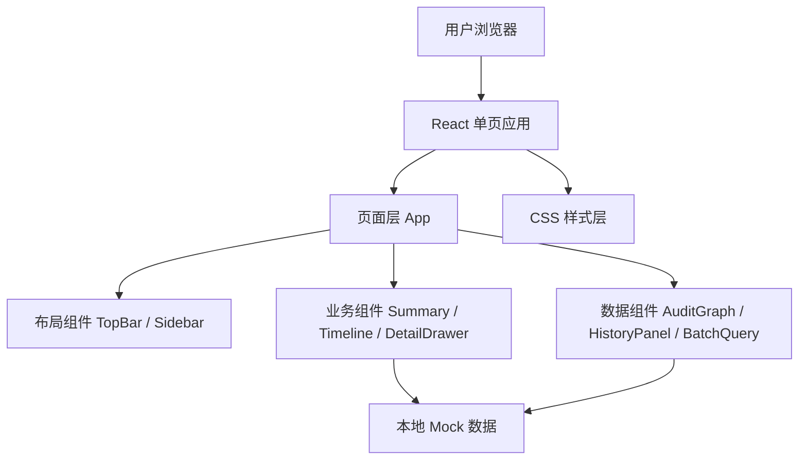

# GNE Seller Onboarding Debug Tool 前端原型技术架构

## 1. 架构设计



## 2. 技术说明

- 前端：React 18 + TypeScript + Vite
- 样式：CSS Modules 或普通 CSS，使用 CSS 变量管理 Pearl 风格色板
- 后端：无，全部使用本地 mock 数据
- 数据库：无
- 图标：优先使用 CSS 和文本符号，避免引入不必要依赖
- 质量门禁：`npm run build` 验证 TypeScript 和打包

## 3. 路由定义

| 路由 | 用途 |
|------|------|
| `/` | Debug Tool 单页原型，包含所有核心交互 |

## 4. 数据模型

### 4.1 TypeScript 类型

```typescript
type SellerStatus = 'Active' | 'Rejected' | 'Pending' | 'In Review';
type ReviewStatus = 'pass' | 'reject' | 'pending' | 'skipped';

interface Seller {
  id: string;
  name: string;
  status: SellerStatus;
  shopLevel: string;
  sellerType: string;
  companyName: string;
  code: string;
  violationScore: number;
  probationStatus: string;
}

interface TimelineNode {
  id: string;
  name: string;
  status: ReviewStatus;
  owner: string;
  startTime: string;
  endTime?: string;
  description?: string;
  isCurrentBlocker?: boolean;
}

interface ReviewDetail {
  nodeId: string;
  title: string;
  result: ReviewStatus;
  reviewer: string;
  rejectCode?: string;
  reason?: string;
  nextAction?: string;
  evidence: EvidenceFile[];
  systemFields: Record<string, string>;
}

interface EvidenceFile {
  id: string;
  type: string;
  name: string;
  status: 'available' | 'expired' | 'missing';
}

interface BatchResult {
  sellerId: string;
  status: SellerStatus;
  blockedStage: string;
  reason: string;
  action: string;
}
```

## 5. 目录结构

```text
/workspace
├── package.json
├── index.html
├── src
│   ├── main.tsx
│   ├── App.tsx
│   ├── styles.css
│   ├── data
│   │   └── mockData.ts
│   ├── types
│   │   └── index.ts
│   └── components
│       ├── TopBar.tsx
│       ├── Sidebar.tsx
│       ├── SellerSummary.tsx
│       ├── DiagnosticSummary.tsx
│       ├── Timeline.tsx
│       ├── DetailDrawer.tsx
│       ├── EvidenceGrid.tsx
│       ├── AuditAndHistory.tsx
│       └── BatchQuery.tsx
└── .trae/documents
```

## 6. MVP 实现切片

1. 初始化 Vite React TypeScript 工程，建立布局和 Pearl 风格基础样式。
2. 实现 seller 基础卡片、诊断摘要、时间线 mock 展示。
3. 实现 Detail 抽屉和 evidence 预览。
4. 实现 QA/Thunder 双栏信息展示。
5. 实现批量查询 mock 交互。
6. 执行构建验证并修复问题。

## 7. 安全边界

- 不接入真实 Pearl、QA Tool、Bits、Thunder 接口。
- 不写入任何 token、cookie、API key 或真实内部凭证。
- 使用 mock 数据模拟 seller、review、file、task 信息。
- evidence 使用本地 CSS 占位卡片，不展示真实证件图片。
